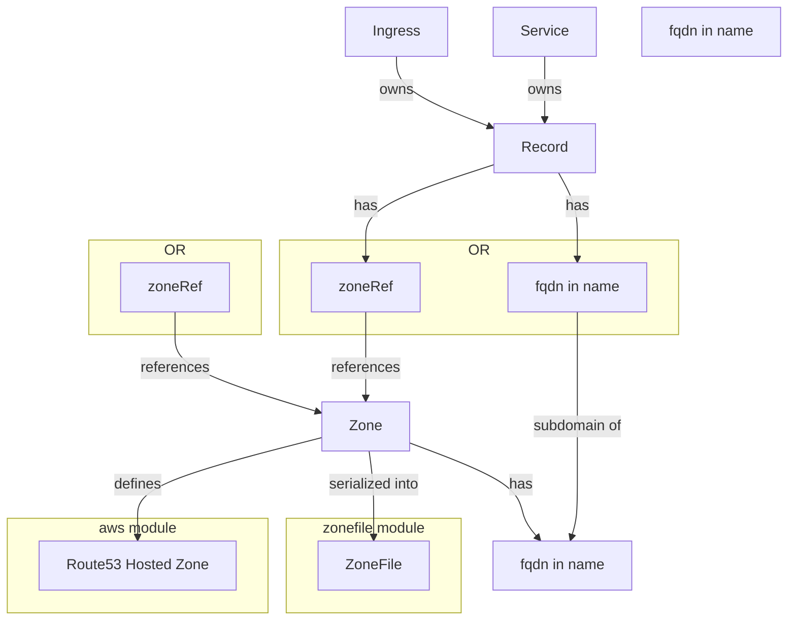

# kubizone

`kubizone` is a Kubernetes ecosystem of DNS resources and controllers, with the following components:

* [Core CRDs](/kubizone-crds/). Defines the `Zone` and `Record` Custom Resources.
* [Core Controller](/kubizone/). Populates and manages linkages between `Record`s and `Zone`s, propagating changes up through sub-zones to invalidate `Zone` hashes, which in turn can be picked up by provider-specific controllers.
* [Zonefile CRDs](/kubizone-zonefile-crds/). Defines the `ZoneFile` Custom Resource which tracks a `Zone` and its `Record`s.
* [Zonefile Controller](/kubizone-zonefile/). Monitors `ZoneFile`s (re)populating a `ConfigMap` with the  [RFC1035 Zonefile](https://datatracker.ietf.org/doc/html/rfc1035#section-5) representation of the graph.

