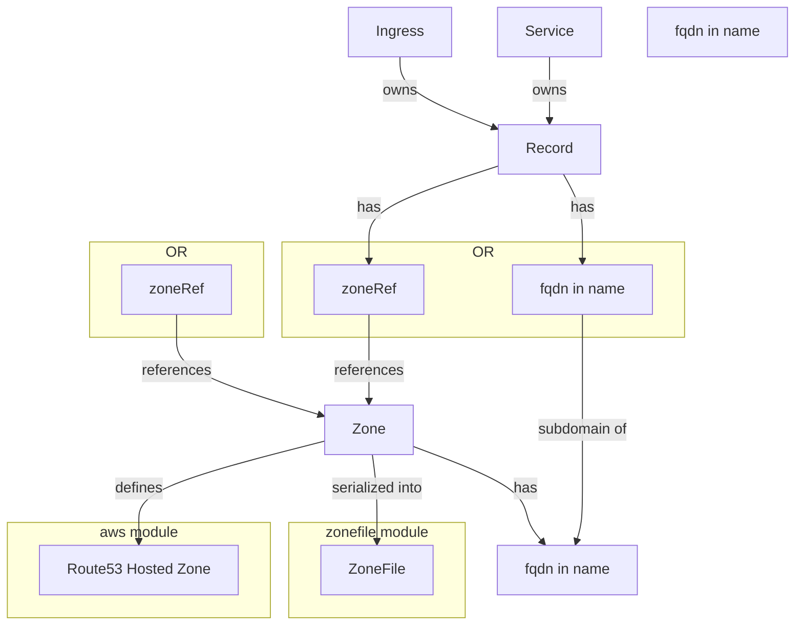

# dnsetes

```mermaid
flowchart TD
    Service-- owns -->Record
    Ingress-- owns -->Record
    RecordName-- subdomain of -->ZoneName1
    Record-- has -->RecordName["fqdn in name"]
    Record-- has -->ZoneRef1
    subgraph OR1[OR]
        ZoneRef1[zoneRef]
        RecordName
    end
    ZoneRef1-- references --> Zone
    ZoneRef2-- references --> Zone
    Zone-- has -->ZoneName1["fqdn in name"]
    ZoneName2["fqdn in name"]
    subgraph OR2[OR]
        ZoneRef2[zoneRef]
    end
    Zone-- serialized into -->ZoneFile
    Zone-- defines -->Route53
    subgraph zonefile module
        ZoneFile
    end
    subgraph aws module
        Route53[Route53 Hosted Zone]
    end
```
