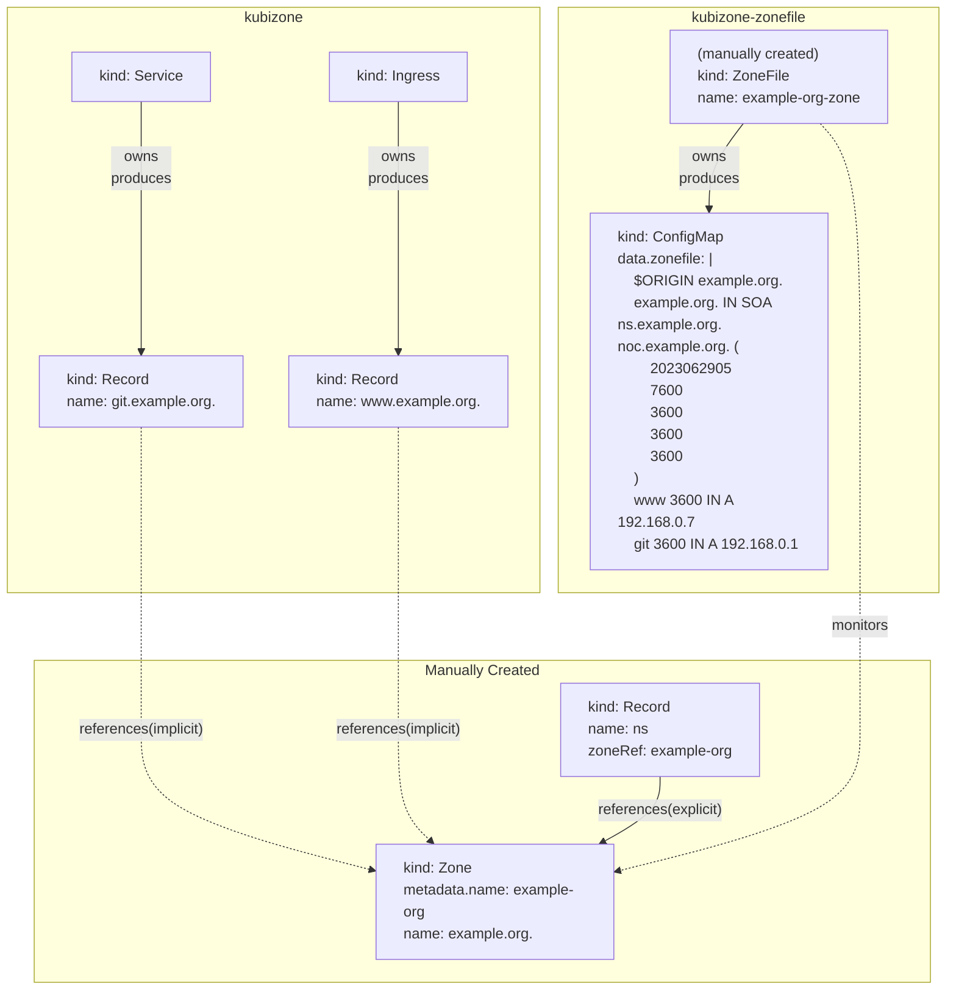

```mermaid
flowchart TD
    subgraph kubizone-zonefile
        ZoneFile["(manually created)\nkind: ZoneFile\nname: example-org-zone"]
        ConfigMap["kind: ConfigMap\ndata.zonefile: |\n&nbsp;&nbsp;&nbsp;&nbsp;$ORIGIN example.org.&nbsp;&nbsp;&nbsp;&nbsp;\n&nbsp;&nbsp;&nbsp;&nbsp;example.org. IN SOA ns.example.org. noc.example.org. (\n&nbsp;&nbsp;&nbsp;&nbsp;&nbsp;&nbsp;&nbsp;&nbsp;2023062905\n&nbsp;&nbsp;&nbsp;&nbsp;&nbsp;&nbsp;&nbsp;&nbsp;7600\n&nbsp;&nbsp;&nbsp;&nbsp;&nbsp;&nbsp;&nbsp;&nbsp;3600\n&nbsp;&nbsp;&nbsp;&nbsp;&nbsp;&nbsp;&nbsp;&nbsp;3600\n&nbsp;&nbsp;&nbsp;&nbsp;&nbsp;&nbsp;&nbsp;&nbsp;3600\n&nbsp;&nbsp;&nbsp;&nbsp;)\n&nbsp;&nbsp;&nbsp;&nbsp;www 3600 IN A 192.168.0.7\n&nbsp;&nbsp;&nbsp;&nbsp;git 3600 IN A 192.168.0.1"]
    end

    subgraph Manually Created
        Zone["kind: Zone\nmetadata.name: example-org\nname: example.org."]
        Manual["kind: Record\nname: ns\nzoneRef: example-org"]
    end
    subgraph kubizone
        Service["kind: Service"]
        Ingress["kind: Ingress"]
        Web["kind: Record\nname: www.example.org."]
        Git["kind: Record\nname: git.example.org."]
    end
    
    Git-. "references(implicit)" ..->Zone
    Web-. "references(implicit)" ..->Zone
    Manual-- "references(explicit)" -->Zone
    Service-- "owns\nproduces" -->Git
    Ingress-- "owns\nproduces" -->Web

    ZoneFile-- "owns\nproduces" -->ConfigMap
    ZoneFile-. "monitors" ...->Zone

    style Zone text-align:left
    style ZoneFile text-align:left
    style Manual text-align:left
    style Git text-align:left
    style Web text-align:left
    style ConfigMap text-align:left
```